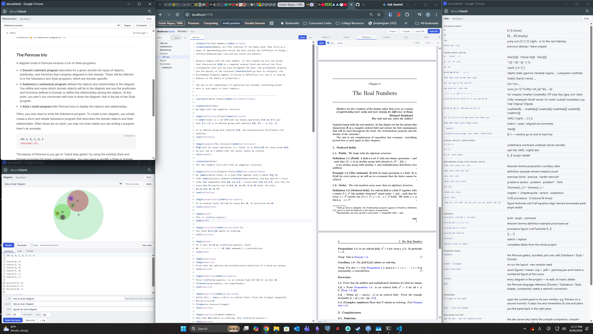

# A warning 
this is as vibe-coded as you can get !! i will likely never write a line of code for this because I don't want to. 
Here's a simple image of a sample book file generated by claude, but I hope to use this to speed up actual cleaning up of notes beyond 
my obsidian repos (which are not really exportable nicely). 



# Mathbook Studio

A browser-only (vibe-coded) writing environment for mathematics notes and books built on the
`mathbook` LaTeX class that is basically just me asking claude to write some shared logic from books I've enjoyed:

* **Editor** (CodeMirror 6) with the Obsidian LaTeX Suite editing model —
  auto-expanding snippets, tabstops, auto-fraction, tab-out, matrix
  shortcuts, visual snippets, conceal, inline math preview — plus snippets
  and hotkeys for every construct in the class (`;thm`, `;exr`, `;proc`,
  `;fig`, `\fromtext`, …). Toggle **Assist / Raw** at the top of the editor.
* **Diagram panel** running [Penrose](https://penrose.cs.cmu.edu) in the
  browser: 145 bundled examples from the Penrose gallery, edit
  Substance / Style / Domain, resample layouts, and **Insert into book** —
  which saves `figures/<name>.svg`, `figures/<name>.pdf` (vector) and the
  Penrose source next to it, and drops a numbered `figure` at the cursor.
  The **Docs** tab embeds the Penrose language reference (online).
* **Pop-out panels**: the ⧉ button next to the right-pane tabs opens the
  current panel (Diagram, Library, Preview, Docs, …) in its own window, e.g.
  on a second monitor. It stays live, and **Dock** or closing the window puts it back.
* **Projects** stored in the browser (IndexedDB). New book from the template,
  add chapters, import/export as a plain LaTeX folder in a ZIP.

* **Preview** of the whole book, via an optional *compile companion*: a
  dependency-free Node script that runs `latexmk` on your own TeX Live.
  The app detects it (Preview tab turns green), rebuilds after every save
  (debounced) or on **Build PDF** / Ctrl-Enter, shows the PDF with pdf.js,
  lists errors (click to jump to the line), and **Locate** uses SyncTeX to
  scroll the PDF to the cursor. Without the companion the app is fully
  static; compile the exported ZIP with `latexmk -pdf main.tex`.

## Run

```sh
npm install
npm run dev          # http://localhost:5173, also starts the compile companion
npm run build        # static site in dist/
npm run preview      # serve dist/ locally
```

`npm run dev` starts the compile companion (on http://127.0.0.1:4747) in the
same terminal and stops it when Vite exits. If no TeX is found, it installs a
private TeX Live (~350 MB) without asking. Set `NO_COMPILE_SERVER=1` to skip
the companion, for example to run it on its own:

```sh
npm run compile-server   # companion only: whole-book preview, needs latexmk on PATH
                         # flags: --port 4747 --host 127.0.0.1 --dir ~/.mathbook-studio/build
```

`dist/` is a static site (relative asset paths), so it can be served by any
web server. `docker build -t mathbook-studio . && docker run -p 8080:80 mathbook-studio`
gives an nginx image for the homelab, and `Dockerfile.compile` builds a
TeX Live image running the companion (`-p 4747:4747`); set its URL in the
app's Preview tab (`URL…`). Note the browser must be able to reach it, and
a page served over https cannot call an http companion (mixed content).

## Layout of the code

```
src/
  lib/snippets/context.ts   math-mode detection for LaTeX source
  lib/snippets/types.ts     LaTeX Suite snippet format
  lib/snippets/defaults.ts  default snippets (LaTeX Suite port + mathbook class)
  lib/snippets/engine.ts    CodeMirror extension: expansion, tabstops, autofraction, tabout, matrix keys
  lib/snippets/assist.ts    conceal + KaTeX preview (Assist mode)
  lib/latex.ts              LaTeX highlighting and \cref label completion
  lib/project.ts            project model, template, IndexedDB, ZIP import/export
  lib/penrose/render.ts     compile -> optimise (chunked) -> SVG; SVG -> PDF
  lib/compile.ts            client for the compile companion
  components/PreviewPanel   pdf.js viewer, build status, errors, SyncTeX locate
server/compile-server.mjs   the compile companion (Node >= 18, no dependencies)
  lib/penrose/examples.json bundled Penrose gallery trios (MIT, penrose/penrose)
  components/               EditorPane, PenrosePanel, FileTree, SnippetsPanel, HelpPanel, ProjectsDialog
  template/                 mathbook.cls + starter files used for new projects
scripts/smoke.mjs           Playwright end-to-end check (needs `npm run preview` on :4173)
```

## Snippets

The Snippets tab accepts LaTeX Suite's format (JSON, or a JS array with
regex triggers), so an existing `snippets.js` can be pasted in. Options:
`t` text, `m` math, `M` block, `n` inline, `A` auto, `r` regex, `v` visual,
`w` word boundary. Tabstops `$0`, `${1:default}`, `${VISUAL}`; regex groups
`[[0]]`.

## Notes

* Penrose `Text` shapes end up in the PDF with standard PDF fonts (Helvetica /
  Times); `Equation` labels are converted to paths and look exactly as
  previewed.
* Figures are cropped to the drawn content (with 12px padding) when saved.
* The exported ZIP omits build artefacts; `figures/*.pdf` is included so the
  book compiles without Inkscape or the `svg` package.
